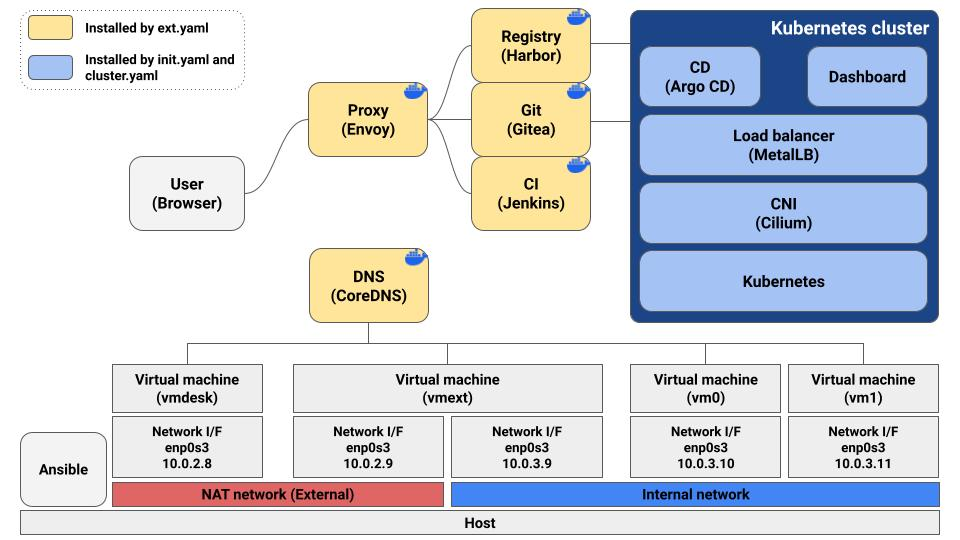

# auto-kube Tutorial using VirtualBox

## Introduction

This documentation is a tutorial for installation of auto-kube on virtual machines using VirtualBox.
We'll make only three virtual machines for this tutorial (plus one for user role)
Now let's take a look at this figure.



This repository assumes that communications to the Internet from Kubernetes cluster passes through vmext and the cluster is hidden from outside.
Therefore vmext has two ethernet interfaces, but it's just for an assumption of some closed circumstances.
So, feel free to have just one ethernet interface whenever you put all virtual machines in a same LAN and make them be able to access to the Internet.
Anyway in this tutorial, We're going to follow the assumption.
Plus, all resources such as docker images will be kept after installation, so you can use this auto-kube even if you can't access to the Internet after installation.


## Configure VirtualBox

**Before get into the setup, here's test environment.**
- Host: Ubuntu desktop
- Installed VirtualBox 7.0 and Ansible 8.3.0 (ansible-core: 2.15.2) on the host
- Virtual machine: Ubuntu 20.04.6 server / amd64
    > Note that auto-kube was tested on Ubuntu 20.04 server and amd64/arm64 

**Now, run VirtualBox and let's make the first NAT network.**
1. Menu ▶ File ▶ Tools ▶ Network Manager  
1. Select NAT Networks tab and click on Create button.
1. You can see NatNetwork having 10.0.2.0/24, it's perfect for us.

## Configure a virtual machine

**We need three same Ubuntu virtual machines, so we're just going to make one virtual machine and copy it.**
1. Menu ▶ Machine ▶ new
1. Fill out the form (Name: vm0, Type: Linux, Version: Ubuntu 20.04 LTS (Focal Fossa) (64-bit)). Then click on the Next button.  
❕You can select ISO image directly, it's totally up to you.
1. Set the hardware (Base Memory: 2048 MB, Processors: 2). Then click on the Next button.
1. Set the hard disk (Create a Virtual Hard Disk Now ▶ Disk Size: 20.00 GB). Then click on the Next button.
1. Click on the Finish button.

**Insert the Ubuntu iso into the vm0.**
1. Select vm0 on the left tab.
1. Click on the Settings button.
1. Go to the Storage tab.
1. Select Empty below Controller: IDE.
1. Click on CD icon and Choose a disk file.
1. Choose your Ubuntu iso.
1. Click on the OK button.

**Let's modify the network adapter setting.**
1. Select vm0 on the left tab.
1. Click on the Settings button.
1. Go to the Network tab.
1. Select Attached to: Internal Network.
1. Click on the OK button.

## Install Ubuntu on the virtual machine

**Now it's time to install Ubuntu on your first virtual machine.**
1. Select vm0 on the left tab.
1. Click on the Start button.
1. Choose your language (English).
1. Choose Continue without updating.
1. Choose Done.
1. We need to set IP address manually, so move your cursor onto enp0s3 and press the enter key.
1. Choose Edit IPv4.
1. Select IPv4 Method: Manual, and set like this (Subnet: 10.0.3.0/24, Address: 10.0.3.2, Gateway: 10.0.3.9, Name servers: 1.1.1.1). Then save it.  
❕Note that the gateway is the address of vmext. It's required if you're going to configure your network structure the same as in this tutorial.
1. Choose Done.
1. Configure proxy, choose Done.
1. Configure Ubuntu archive mirror, choose Done.
1. Choose Continue without updating.
1. Guided storage configuration, choose Done.
1. Just mount the whole space to the "/". To do that, go to the "ubuntu-lv ... mounted at /" and Edit and make Size empty and Save it.
1. Choose Done and Continue on the following confirmation.
1. Fill out the Profile setup (Your name: kube, Your server's name: vm0, Pick a username: kube, Choose a password: kube). Then it's done.
1. SSH Setup, don't forget to check Install OpenSSH server. We need it. Then choose Done.
1. Wait until the installation finish and choose Reboot Now.
1. Press enter to reboot it.
1. Put username/password in the terminal (it's kube/kube in this tutorial)
1. Nice. It's been a long way! Turn it off to copy the machine.

**Replicate vm0.**
1. Right-click on the vm0.
1. Select Clone.
1. Set Name: vm1, MAC Address Policy: Generate new MAC addresses for all network adapters
1. Click on the Next button.
1. Keep Full clone and Click on the Finish button.
1. Do the above steps for replicate vmext too.

## Modify network settings

**vmext has to have two network adapters. So add another adapter.**
1. Select vmext on the left tab.
1. Click on the Settins button.
1. Go to the Network tab.
1. Go to the Adapter 2 tab.
1. Check Enable Network Adapter and Select Attached to: NAT Network. Then click on the OK button.  
❕Remember? We made NAT network at first, which will give us the functionality of communication with the Internet and the host.

**Now, Let's set IP addresses according to our plan.**
1. Turn on vm0 and vm1.
1. Edit /etc/netplan/00-installer-config.yaml on each machine. vm0's address is 10.0.3.10 and vm1's address is 10.0.3.11.
1. Run this command.
    ```sh
    sudo netplan apply
    ```
1. Leave these machines on.

**Set vmext IP addresses.**
1. Turn on vmext.
1. Run this command and you could see enp0s3 and enp0s8.
    ```sh
    ip a
    ```
1. Edit /etc/netplan/00-installer-config.yaml on each machine.
    ```yaml
    network:
      ethernets:
        enp0s3:
          addresses:
          - 10.0.3.9/24
        enp0s8:
          addresses:
          - 10.0.2.9/24
          gateway4: 10.0.2.1
          nameservers:
            addresses:
            - 1.1.1.1
            search: []
      version: 2
    ```
1. Run this command.
    ```sh
    sudo netplan apply
    ```
1. Leave this machine on.

## Change hostnames

**Modify hostnames of both vm1 and vmext.**
1. Run this command. Note that you should put vmext as its name on the vmext machine.
    ```sh
    sudo hostnamectl set-hostname vm1
    ```
1. Open /etc/hosts and change vm0 to vm1 or vmext.
1. You can see the change after re-login.

## Change the inventory file

Now, we need to change the inventory file according to our IP addresses.
Open auto-kube/ansible/inventories/vbox.yaml file and change each ansible_host.
You can see it in the following section.

## Configure more settings for connection through vmext"

We put vmext between the Internet/host and Kubernetes cluster. First, let's add some iptables rules to make a path of packets.

**Add iptables rules on the vmext.**
```sh
sudo sed -i '/net.ipv4.ip_forward/s/^#//' /etc/sysctl.conf
sudo sysctl -p
sudo iptables -A FORWARD -i enp0s3 -o enp0s8 -j ACCEPT
sudo iptables -A FORWARD -i enp0s8 -o enp0s3 -m state --state RELATED,ESTABLISHED -j ACCEPT
sudo iptables -t nat -A POSTROUTING -o enp0s8 -j MASQUERADE
sudo apt update
sudo apt install -y iptables-persistent
```
    
Please choose yes all in the installation screen.

We're going to access to vmext, vm0, and vm1 from host, so let's add an ssh port forwarding rule.

**Add a port forwarding rule on VirtualBox.**
1. Menu ▶ File ▶ Tools ▶ Network Manager  
1. Select NAT Networks tab and NatNetwork we made.
1. Select PortForwarding tab and click on the plus button.
1. Fill out the form (Name: ssh to vmext, Host IP: 127.0.0.1, Host Port: 8022, Guest IP: 10.0.2.9, Guest Port: 22)

We're almost there. Add ssh jump argument in the inventory file because our network structure like this.  
Ansible/Host -- (port forwarding) -- vmext -- vm0 and vm1

**Inventory file(auto-kube/inventories/vbox.yaml)**
```yaml
---
# Ansible inventory
dns:
  hosts:
    dns0:
      ansible_host: 10.0.2.9
      ansible_user: kube
      ansible_ssh_common_args: "-J kube@localhost:8022"

proxy:
  hosts:
    proxy0:
      ansible_host: 10.0.2.9
      ansible_user: kube
      ansible_ssh_common_args: "-J kube@localhost:8022"

registry:
  hosts:
    registry0:
      ansible_host: 10.0.3.9
      ansible_user: kube
      ansible_ssh_common_args: "-J kube@localhost:8022"

git:
  hosts:
    git0:
      ansible_host: 10.0.3.9
      ansible_user: kube
      ansible_ssh_common_args: "-J kube@localhost:8022"

ci:
  hosts:
    ci0:
      ansible_host: 10.0.3.9
      ansible_user: kube
      ansible_ssh_common_args: "-J kube@localhost:8022"

cluster:
  hosts:
    cp0:
      ansible_host: 10.0.3.10
      ansible_user: kube
      ansible_ssh_common_args: "-J kube@localhost:8022"
    node1:
      ansible_host: 10.0.3.11
      ansible_user: kube
      ansible_ssh_common_args: "-J kube@localhost:8022"

all:
  children:
    dns:
    proxy:
    registry:
    git:
    ci:
    cluster:
```

## Modify variables

We're going to make a Kubernetes cluster on the internal network, which has 10.0.3.0/24.
Therefore we should modify some variables according to it.

**Variable file(auto-kube/playbooks/vars.yaml)**
```yaml
...
  metallb:
    ver: 0.13.5
    ip_pool: 10.0.3.100-10.0.3.199
  dashboard:
    chart_ver: 5.10.0   
    ip: 10.0.3.199
  argocd:
    ver: 2.5.2
    ip: 10.0.3.198
...
```

## Register ssh key on the virtual machines

It could be tiresome to put in the password every time you want to access to the virtual machines.
So you can generate ssh key and copy it so that you can access to the virtual machines without the password.
Above all, Ansible requires it.
Here's the procedures.

**Generate ssh key on the host and copy it.**
1. Make sure you don't have ssh key of ed25519 type.
❕Check if both id_ed25519 and id_ed25519.pub don't exist in ~/.ssh directory.
1. Generate ssh key and copy it.
    ```sh
    ssh-keygen -t ed25519 -f ~/.ssh/id_ed25519 -N ''
    ssh-copy-id -o ProxyJump=kube@localhost:8022 kube@10.0.2.9
    ssh-copy-id -o ProxyJump=kube@localhost:8022 kube@10.0.3.10
    ssh-copy-id -o ProxyJump=kube@localhost:8022 kube@10.0.3.11
    ```
1. Now you can access to the virtual machines through ssh without the password.
    ```sh
    ssh -p 8022 kube@localhost
    ```
    ```sh
    ssh -J kube@localhost:8022 kube@10.0.3.10
    ```
    ```sh
    ssh -J kube@localhost:8022 kube@10.0.3.11
    ```

## Run the Ansible scripts

Now we can run Ansible scripts, but before going further, how about you see inside of auto-kube/ansible/init.sh.
You may get aware of usage of ssh-keygen and ssh-copy-id in it.
That's right. init.sh and ext.sh files include some scripts for generating and copy ssh key.
But it will work only if host is in the same LAN with the virtual machines.
We're not in that situation in this tutorial, so we manually did it.
Therefore, the last line in the file is the only one command we haven't done.

**Install tools on vmext**

Run this command on the host (at auto-kube/ansible/).
```sh
ansible-playbook -i inventories/vbox.yaml -K playbooks/ext.yaml
```
BECOME password means Ubuntu user's password, it's kube in this tutorial.
This process usually takes a long time.

**Install Kubernetes cluster on vm0 and vm1**

Run these commands on the host (at auto-kube/ansible/).
```sh
ansible-playbook -i inventories/vbox.yaml -K playbooks/init.yaml
ansible-playbook -i inventories/vbox.yaml -K playbooks/make-cluster.yaml
```
Hope you've done all without any failures!

## Access to the services through proxy

We installed proxy(Envoy) and auto-kube assumes users will access to our services through it.
So, you need a virtual machine(vmdesk) on NAT network to act as an user.
You can install any OS you want and use browser on it.
Don't forget to set your DNS to 10.0.2.9.

## Print out initial access information

**Print**

Run this command on the host (at auto-kube/ansible/).
```sh
python3 show.py
```

Then, you can see all initial access information, which is collected from inventory, variable, and kept files.
You can delete auto-kube/ansible/playbooks/.keep whenever you're ready.
Don't forget to use those URLs on NAT network.  
>❕we've already installed Jenkins plugins, so now just skip Customize Jenkins screen by pushing x button when you're accessing to CI server.  
>❕For now, auto-kube doesn't support DNS mapping for Kubernetes services. Please use IP addresses instead. And unfortunately, they are inside of internal network in this tutorial, so please set your network I/F gateway to 10.0.2.9 so that you can reach the Kubernets cluster.  
>❕auto-kube also sets up some samples on Git, CI, and CD, so please refer to it.
